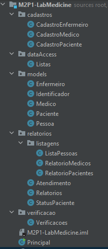

# M2P1 - Sistema LabMedicine

---
### Este é o LabMedicine, sistema médico que resolverá todos os seus problemas em apenas um lugar!

---

## Soluções médicas

        O LabMedicine é um sistema feito para resolver todos os
    problemas de cadastro médico que uma pessoa pode enfrentar 
    utilizando outros sistemas. Aqui você possui o cadastro de
    todos os profissionais e pacientes envolvidos, além de fornecer
    opções de atualização de status de médicos e pacientes e
    relatórios importantes que podem ser tirados a qualquer momento
    no sistema.

## Adaptável e Descritível

        O sistema possui a grande vantagem de fornecer informações
    importantes para a utilização do sistema, tornando-o de fácil
    acesso para o usuário.
        Não só isso, este maravilhoso programa feito em Java
    também fornece uma leitura bem simples do seu código para
    futuros desenvolvedores, fazendo com que a ferramenta seja
    de fácil adaptação para qualquer ambiente médico, e podendo
    suprir ainda mais demandas hospitalares.
        Utilizando Programação Orientada a Objeto (POO), faz com
    que esse sistema seja fácil de mexer, tendo classes com nomes
    literais e métodos auto-descritivos.
    

###### Imagem acima: Organização de classes e pastas do sistema.

## Execução simples

        A Execução de um arquivo Java não requer muitos esforços.
    Aqui está um passo a passo bem simples de como executar o
    sistema utilizando apenas o CMD do windows:

        Já dentro do terminal, você irá procurar pelo caminho,
    a pasta na qual você deixou o programa salvo.
        Utilize o comando "cd" para navegar entre pastas no CMD,
    até chegar na seguinte pasta:

#### (caminho em seu computador)\M2P1-LabMedicine

        Após chegar nesse ponto pelo CMD, é necessário utilizar o
    seguinte compilador do Java, que é apenas um comando que
    deve ser digitado no próprio CMD:

#### javac LabMedicine.java

        Isso irá inicializar a compilação do sistema no seu
    computador. Após esse passo, você simplesmente precisará
    digitar:

#### java LabMedicine

        E pronto, o sistema está rodando perfeitamente em seu
    Prompt de comando (CMD).
        Labmedicine.java é a classe principal (main) da aplicação
    Java. Caso ela seja diferente ou por qualquer motivo seja
    modificado. Lembre de modificar também na hora da execução.

## Aberto para novas ideias

        Mesmo que seja um sistema com várias funcionalidades,
    ele foi planejado para que fosse possivel fazer modificações
    necessárias para cada cenário. Logo, ele está aberto para
    receber qualquer melhoria que o utilitário necessitar.
        Algumas exceções não foram cobertas no cadastro de
    pacientes e profissionais, que poderiam tornar o programa ainda
    mais funcional para o usuário. Algumas informações não estão
    sendo usadas pelo sistema. Dependendo da necessidade do
    cliente, elas podem ser muito melhor aproveitadas.

## Agradecimentos

        Este sistema foi uma colaboração na qual os requisitos
    foram feitos pelo Senai/Lab365, e o desenvolvimento feito por
    Adler Hamann Martins.
        Fico contente em trazer para todos mais um sistema funcional
    que, no futuro, pode trazer benefícios a todos os envolvidos,
    inclusive você, usuário.

#### Muito obrigado!